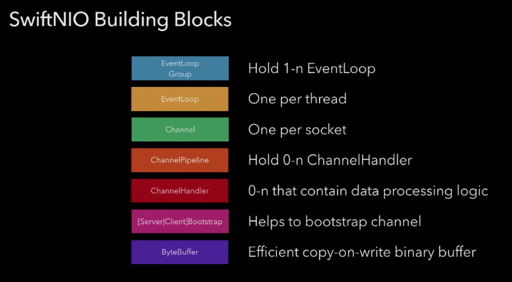
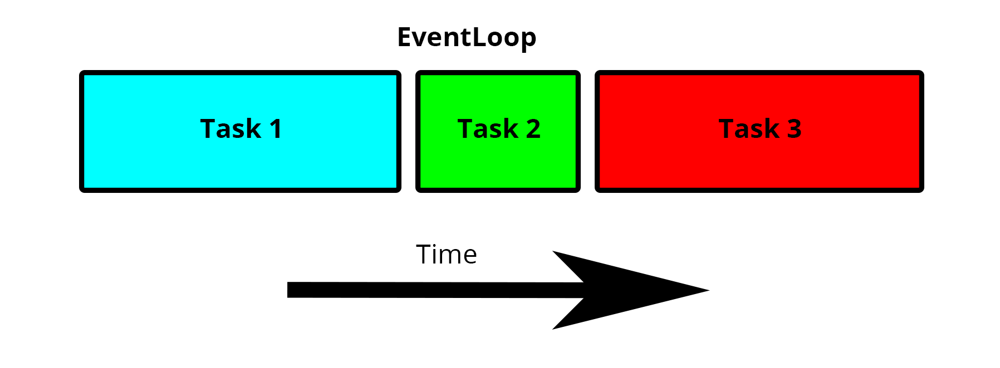
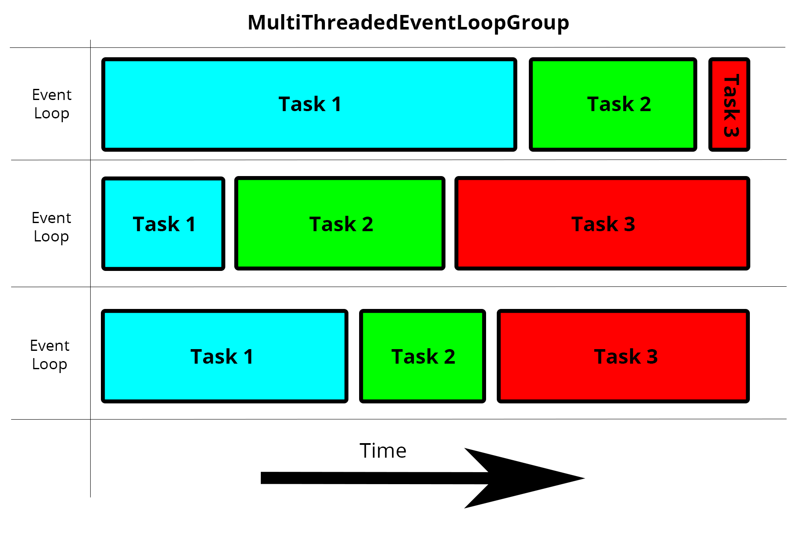
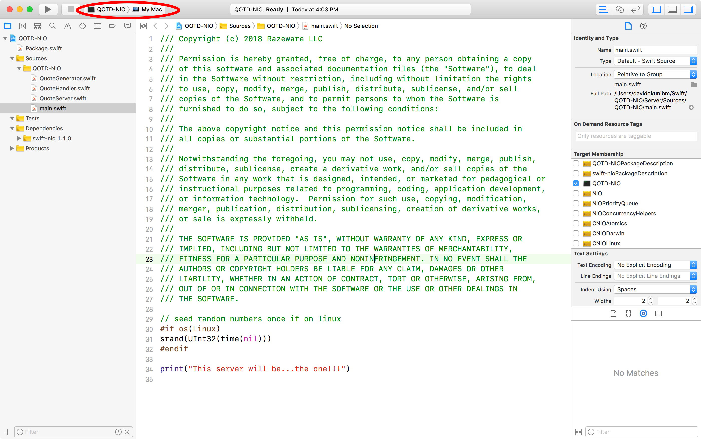

Mobile developers often work with REST APIs or other networking protocols in their applications — whether it’s to retrieve data, communicate with other devices, or something else. [SwiftNEO](http://docutils.sourceforge.net/mirror/setext.html), written by Apple, is a low-level networking framework that makes writing Swift servers even easier than before, empowering Swift developers to leverage their skills on the server side.

In this tutorial, you’ll:
* Learn about what purpose SwiftNIO serves and why Apple made and open-sourced it.
* Practice working within a SwiftNIO framework by creating a Quote Of The Day Swift TCP server that you’ll connect to using a provided iOS app.

To start, you’ll need a Mac running at least macOS 10.12 Sierra with Xcode 9.3 or later. You’ll also use the command line, so be sure to open up Terminal, and check the command line utility for Swift is installed. You can check this by entering [Swift Version](http://docutils.sourceforge.net/mirror/setext.html). It must be version 4.1 or later.

> Note: The command line tool you need should be installed with Xcode. If you don’t successfully see your version of Swift when running the swift –version command, go here for more information.

## Getting Started
First, it’s helpful to understand exactly how the SwiftNIO framework differs from other Swift frameworks.

### Swift-on-the-Server Status Quo
If you’re a Swift developer, it’s very likely you’ve focused only on mobile applications. This makes servers in the cloud seem like voodoo magic — or at least a little confusing at first.

Thankfully, if you know Swift, frameworks like [Kitura](http://docutils.sourceforge.net/mirror/setext.html) and [Vapor](http://docutils.sourceforge.net/mirror/setext.html) make writing a web service easier.

However, these frameworks operate as a convenient layer on top of some sophisticated and low-level socket networking code, much of which interoperates with C. In the case of Kitura, once Swift became open sourced and available for Linux, IBM wrote [BlueSocket](http://docutils.sourceforge.net/mirror/setext.html) to serve as its low-level socket networking layer.

### How SwiftNIO Differs
BlueSocket is great, but it doesn’t fill in all the blanks when it comes to server-side Swift. For example, Kitura not only included the work of BlueSocket, but it also implemented the entire HTTP stack under the hood, so incoming communication would be routed the right way. Now, Apple has raised the bar, introducing [SwiftNEO](http://docutils.sourceforge.net/mirror/setext.html) and essentially handling socket communication and HTTP for us.
> Note: SwiftNIO has been written as a port of Netty, a Java low-level networking framework, but in Swift.



This tutorial won’t go into great detail about every piece of the above diagram but, as you work your way through, each piece should begin to make sense. However, it’s worth explaining what an [EventLoopGroup]() is and, thus, what a [MultiThreadedEventLoopGroup]() accomplishes with this class.
#### EventLoopGroup and MultiThreadedEventLoopGroup
An [EventLoop]() runs in a loop, looking for new tasks to handle that have come in from a new client via a network connection. Think of an EventLoop like a serial [DispatchQueue](), which allows you to delegate blocks of code for execution at a time of your choosing. As multiple EventLoop instances cycle through your thread, they look for tasks to execute.



When you put these EventLoop instances into an EventLoopGroup, the handler looks more like a concurrent DispatchQueue. You can also think of this like a thread pool. This means you can submit multiple tasks to the group and, depending on the time it takes to complete each task, the order of completed tasks may not be what you initially submitted to the group.

This is where the **MultiThreadedEventLoopGroup** class comes in. This specifies the EventLoopGroup that’s created will tie each group to a specific thread, further streamlining your asynchronous operations that come in. Think of it like an upgraded EventLoopGroup.



## Setting Up Your Server Project
Open Terminal and navigate to the root directory of the starter project. Enter the following commands:
```bash
cd Server/
swift build
swift package generate-xcodeproj
open QOTD-NIO.xcodeproj
```
Once Xcode opens, go to the top of the window and, in the scheme selector, select QOTD-NIO and My Mac like so:

Build and run the project. At the bottom of the debugger, you should see a single printed message: This server will be… the one!!! If you see this, you’re ready to dive in.
## Bootstrapping a Server
In Xcode, open QuoteServer.swift. This is where you’re going to set up your server to bind to a port.
Replace the code in this file with the following:
```swift
import Foundation
// 1
import NIO

enum QOTDError: Error {
  case invalidHost
  case invalidPort
}

public class QuoteServer {
  // 2
  private let group = MultiThreadedEventLoopGroup(numThreads: System.coreCount)
  private var host: String?
  private var port: Int?
  
  init(host: String, port: Int) {
    // 3
    self.host = host
    self.port = port
  } 
}

```
What this code is doing:
1. You import the NIO module in this class — you won’t get far without it!
2. You specify a MultiThreadedEventLoopGroup when you run your server, as you learned earlier. You can run as many threads as your system will allow you here — use the System API for this.
3. You set the host and port the server will listen on. You could perform validation logic on your host and port here, if needed.

Now, you’ll add a private variable for an object that you need called a ServerBootstrap. Think of this class as a helper class that sets up a server for you to serve information that you delegate. Inside your class declaration, but below init(host:port:), add this:
```swift
private var serverBootstrap: ServerBootstrap {
  // 1
  return ServerBootstrap(group: group)
    .serverChannelOption(ChannelOptions.backlog, value: 256)
    // 2
    .serverChannelOption(ChannelOptions.socket(SocketOptionLevel(SOL_SOCKET), SO_REUSEADDR), value: 1)
    .childChannelInitializer { channel in
      // 3
      channel.pipeline.add(handler: BackPressureHandler()).then { v in
        // 4
        channel.pipeline.add(handler: QuoteHandler())
      }
    }
    // 5
    .childChannelOption(ChannelOptions.socket(IPPROTO_TCP, TCP_NODELAY), value: 1)
    .childChannelOption(ChannelOptions.socket(SocketOptionLevel(SOL_SOCKET), SO_REUSEADDR), value: 1)
    .childChannelOption(ChannelOptions.maxMessagesPerRead, value: 16)
    .childChannelOption(ChannelOptions.recvAllocator, value: AdaptiveRecvByteBufferAllocator())
}
```
Looking at the code above:
1. You assign the bootstrap a MultiThreadedEventLoopGroup — it needs to know which run loops to utilize on your machine.
2. You specify you want your channel — or your communication pipe — to connect with a networking socket available on your machine and to reuse the local address on your machine (REUSEADDR).
3. Once communications come through the bootstrap, the channels that are the children of this bootstrap also need work to do — the BackPressureHandler() basically ensures that reading a new request only happens as fast as the server is writing a response.
4. You then specify that you want to write your own custom class to handle incoming communication from the outside world — you’ll work on this class shortly.
5. Finally, you specify that your server will operate on TCP and that you won’t delay the sending of any packets of information as a response.
 
> Note: In the code block above, the explanation covers only the options that directly affect this tutorial. However, to learn more about the others, refer to the official Apple SwiftNIO Docs.
 
Build and run your project. You should see the same result as before. You still have a few more steps to complete your working QOTD server.