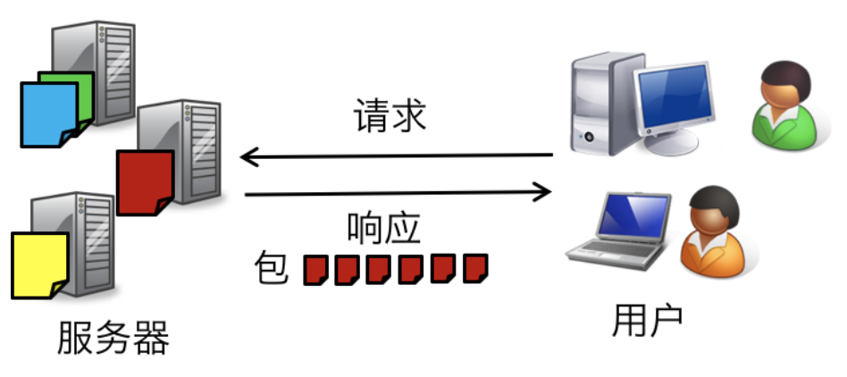
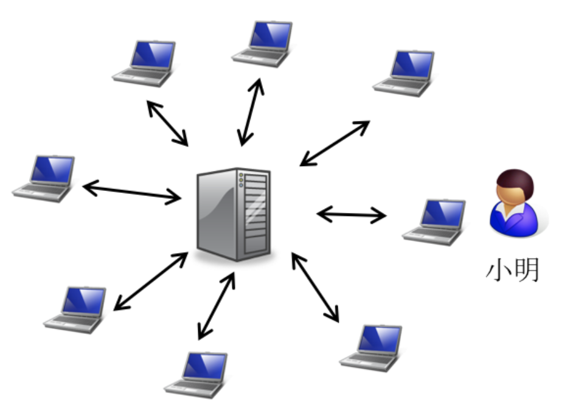

上周关于比特币的文章《讲讲比特币这个故事》收到了近千的阅读，但还是收到了例如“请写点人看的东西…”之类的评论。于是我们今天来讲一个稍微好理解一点的东西 —— "种子"

如果你经常用迅雷下载电影、电视剧等其他大文件，你一定对以“.torrent”为后缀名的种子文件不陌生，或是如果你常驻百度贴吧等论坛，也一定对“留图不留种，某花万人捅”的说法有所耳闻：如果你放了一张电影的海报，但没有给“.torrent”文件，那你就会收到上面这条回复；如果你放了，大家则会在评论里祝你“好人一生平安”。这就是网上俗称的“种子”，配合专用的客户端，比如迅雷、快播等，可以实现快速稳定的大文件下载。

但这到底是怎样一种黑科技？为什么下载一个十几G的大文件不直接在浏览器里点击下载，而需要下载像".torrent"后缀的种子文件，用迅雷这样的特殊软件才能进行下载呢？今天就来浅析一下比特流 BitTorrent 这个技术。

我们先来假设这样一个普通的场景：

> 小明是一名热爱学习的大二学生，他听说“我爱学习网”新上线一份大小为12.5G的所谓“艺术史学习资料”，他应该怎样下载呢？

## 下载的本质是文件的传输
与最普通的在浏览器里点按页面上的“下载”按钮实现下载相比，用比特流 / 种子实现下载到底有什么区别？可能有人会说是速度——用种子+迅雷下载可能比浏览器直接下载更快，但速度只是结果。我们稍后会讲过程上的区别，但从本质上说，他们二者没有任何区别：都是**将要下载的文件从文件所在电脑（浏览器）传输到下载者的电脑上**。

这里需要强调的是，任何网站的服务器其实也是电脑，和我们平时使用的电脑除了在部分软件和硬件上的优化外没有任何电脑，所以以下我们所说的任何电脑包括所有网站的服务器，或者简而言之 “**服务器 = 电脑**”。

如果小明使用浏览器下载，在找到“我爱学习网”的对应页面后点击下载按钮，那么这时他的浏览器会发送一个请求到“我爱学习网”的服务器上，服务器在收到请求后，将“艺术史学习资料”这个大文件切割成1kb大小的“包”（packet）开始传输给小明的电脑。

如果小明的平均带宽在20MB/秒，而服务器的带宽在1000MB/秒，且当前只有小明一个人在下载“艺术史学习资料”的话，那么他可以以平均20MB/秒的速度收到文件。在12.5GB * 1024 / （20MB/秒） = 640秒后，小明收到了“艺术史学习资料”，小明很开心。

## 比特流是点对点传输
然而不巧的是，“艺术史学习资料”是一个极其受欢迎的学习资料。在“我爱学习网”上线这一资料后，下载者蜂拥而至，平均每个时段有至少500人同时下载，而他们电脑的平均带宽也是20MB/秒。

也就是说，小明从原本20MB/秒的下载速度下降到可怜的0.1MB/秒。更令他懊恼的是，有的时候，“我爱学习网”的服务器会由于太多人访问而断联，即使是之前下载到了90%，也要重新开始下载。

