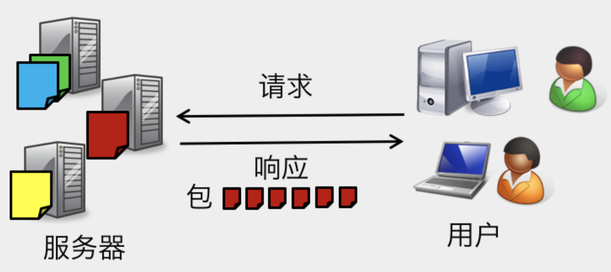
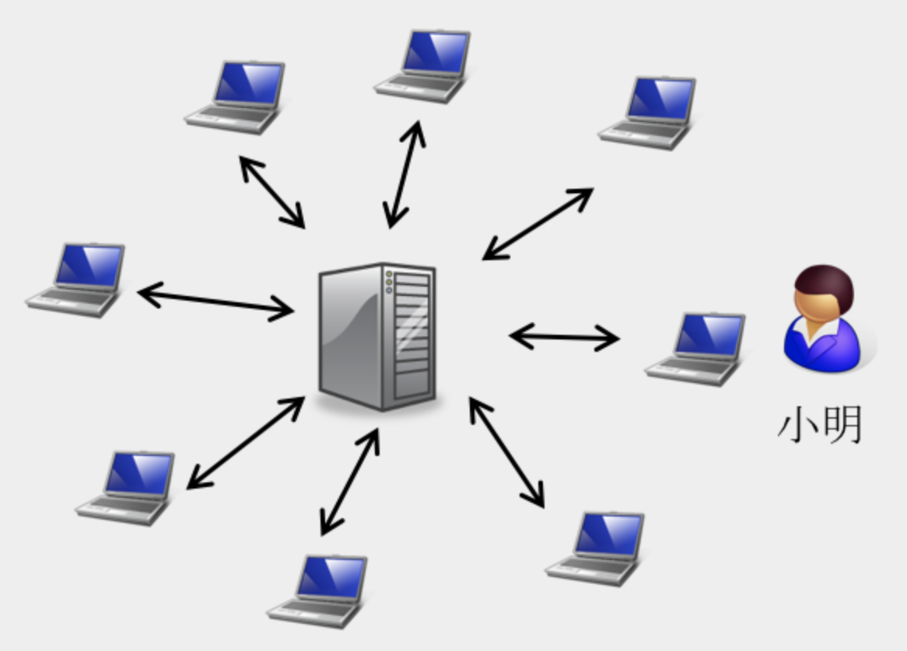
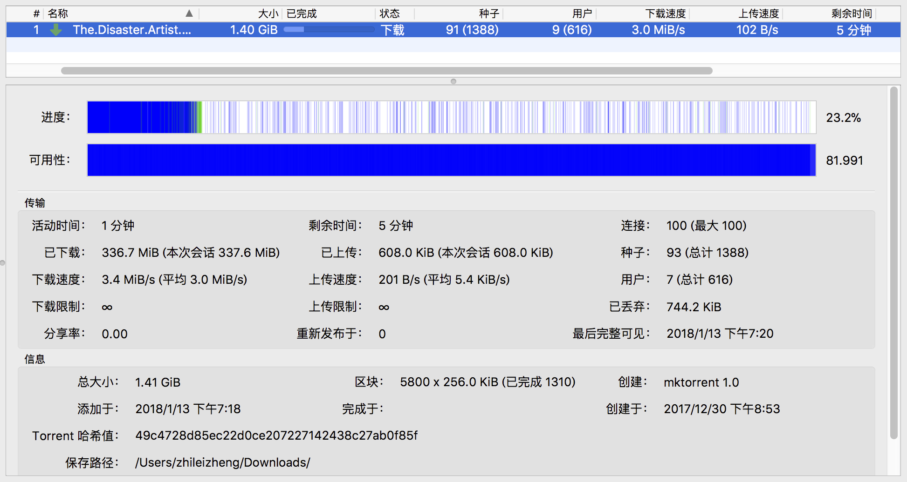
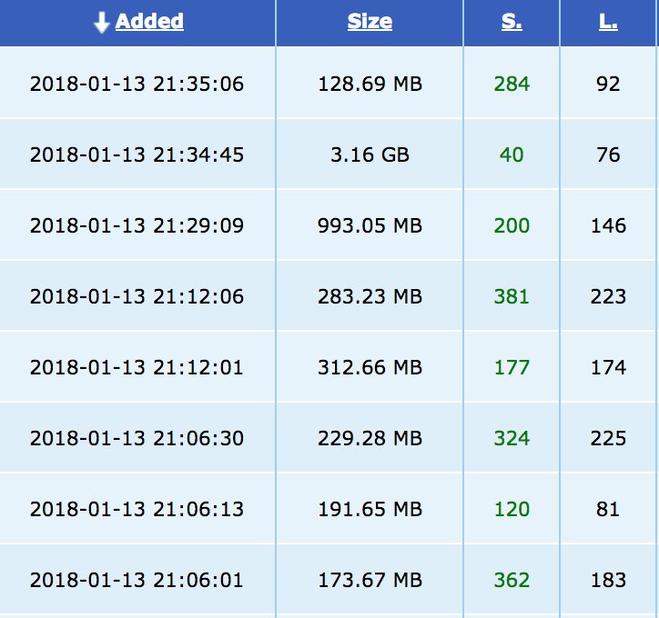
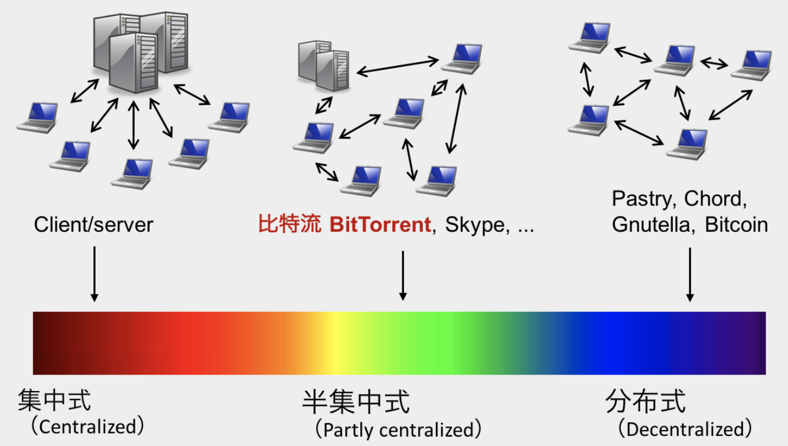

如果你经常用迅雷下载电影、电视剧等其他大文件，你一定对以“.torrent”为后缀名的种子文件不陌生，或是如果你常驻百度贴吧等论坛，也一定对“留图不留种，某花万人捅”的说法有所耳闻：如果你放了一张电影的海报，但没有给“.torrent”文件，那你就会收到上面这条回复；如果你放了，大家则会在评论里祝你“好人一生平安”。这就是网上俗称的“种子”，配合专用的客户端，比如迅雷、快播等，可以实现快速稳定的大文件下载。

但这到底是怎样一种黑科技？为什么下载一个十几G的大文件不直接在浏览器里点击下载，而需要下载像".torrent"后缀的种子文件，用迅雷这样的特殊软件才能进行下载呢？今天就来浅析一下比特流 BitTorrent 这个技术。

我们先来假设这样一个普通的场景：

>小明是一名热爱学习的大二学生，他听说“我爱学习网”新上线一份大小为12.5G的所谓“艺术史学习资料”，他应该怎样下载呢？

### 1. 下载的本质是文件的传输

与最普通的在浏览器里点按页面上的“下载”按钮实现下载相比，用比特流 / 种子实现下载到底有什么区别？可能有人会说是速度——用种子+迅雷下载可能比浏览器直接下载更快，但速度只是结果。我们稍后会讲过程上的区别，但从本质上说，他们二者没有任何区别：都是**将要下载的文件从文件所在电脑（浏览器）传输到下载者的电脑上。**这里需要强调的是，任何网站的服务器其实也是电脑，和我们平时使用的电脑除了在部分软件和硬件上的优化外没有任何电脑，所以以下我们所说的任何电脑包括所有网站的服务器，或者简而言之 **“服务器 = 电脑”。**

如果小明使用浏览器下载，在找到“我爱学习网”的对应页面后点击下载按钮，那么这时他的浏览器会发送一个请求到“我爱学习网”的服务器上，服务器在收到请求后，将“艺术史学习资料”这个大文件切割成1kb大小的“包”（packet）开始传输给小明的电脑。

### 2. 比特流是点对点传输
然而不巧的是，“艺术史学习资料”是一个极其受欢迎的学习资料。在“我爱学习网”上线这一资料后，下载者蜂拥而至，平均每个时段有至少500人同时下载，而他们电脑的平均带宽也是20MB/秒。

也就是说，小明从原本20MB/秒的下载速度下降到可怜的0.1MB/秒。更令他懊恼的是，有的时候，“我爱学习网”的服务器会由于太多人访问而断联，即使是之前下载到了90%，也要重新开始下载。

以上所描述的是最基本也是最传统的由一个中央服务器群发资源数据的模式，**它的问题在于可伸缩性（scalability）太差，受制于中央服务器性能和带宽的瓶颈。** 我在比特币的文章里提到过集中式系统和分布式系统的概念对比，以上描述的就是典型的集中式系统可伸缩性差的问题，而这一问题解决的答案就是引入分布式的思想，即**如果资源获取者也是资源的发布者，那么我们就相当于把下载的电脑也变成服务器，网络中同时可以有多个服务器共同发布同一个资源，分担大批下载的带宽压力。**这就是比特流BitTorrent的设计初衷。

比特流是一种点对点网络（Peer-to-Peer Network，简称P2P网络），学界又称之为**对等网络**。只所以称之为对等网络，是因为资源发布者不再是以一个中央节点的形式，而是等同于（peer to）所有网络参与者（peer)：正在下载的所有节点都可以成为与初始发布者一样的发布者（如上图所示），当他们下载完成所有的数据包，即拥有完整文件后，他们在网络中与初始发布者的作用没有区别。我们通过小明的例子再来更详细地解释这一过程。

### 3. 种子和做种

“我爱学习网”在收到诸多网友投诉后，终于认识到传统的传输办法无法稳定快速地把12.5G的好货分享给大家，于是就发布了一则公告：“请大家使用迅雷下载我站资料。”，也同时发布了“最新艺术史学习资料.torrent” 文件要求大家下载并使用迅雷打开开始下载。

#### “种子”文件

这里的“.torrent”文件被网友们称为“种子”，但其实“种子”在比特流网络里并不指代这类文件本身，稍后会讲到。为了严谨起见，我们叫它torrent文件。

这个文件是资源发布者，这里也就是“我爱学习网”，自行制作的。制作过程是“我爱学习网”先将“艺术史学习资料”切割成大小相同的小数据包（通常在1kb）左右，并用SHA-1单向散列函数对每一个包进行加密（目的是让接收者可以验证每个包没有被篡改）。之后，“我爱学习网” 首先在.torrent文件里记录下有关资源的地址信息，即自己网站服务器的地址，以及资源所在路径，然后记录“艺术史学习资料”内所有文件的文件名、大小、数据包数量，以及每一个数据包的散列值。

这就是一个完整的torrent文件，“我爱学习网”也成为了“艺术史学习资料”资源的发布者（seeder），也称为初始种子（initial seeder）。是的，**种子指的是提供完整资源的用户**，而不是某一个文件。

#### 互惠原则

在发布了“最新艺术史学习资料.torrent”后，小明和网友们纷纷下载，并开始了迅雷下载任务。小明很欣慰地看到，自己的下载速度始终保持在10MB/秒左右，甚至越来越块。

这是比特流网络吸引用户的神奇之处：**同时下载的人越多，下载速度反而越快。** 因为正在下载的用户会通过客户端将自己已下载的数据包上传到比特流网络上，供其他尚未下载到这些数据包的用户下载。的确，小明在自己的迅雷客户端上看到的不仅又自己下载速度，也有自己的上传速度。有时当自己的下载速度变慢时，上传速度会超过下载速度。

比特流网络鼓励用户尽量多上传自己已下载的数据包给其他用户，这样能最大程度地保证资源的可用性。为激励用户多上传，比特流网络在参与者之间实行**互惠原则** —— 参与者优先上传给为自己提供下载最多的其他用户。

如果网络中有很吝啬的用户，只下载，不上传，他的下载速度将很慢，因为同样也不会有人为他优先提供数据包。相反，如果用户很大方，对于每一个其他用户多提供了数据，那么所有其他用户也都将为他提供数据。

当小明完成下载后，只要他不删除资源，他还会继续向比特流网络上传资源，他的电脑就变成了一个种子（Seeder）。**这时，他在比特流网络中发挥的角色与“我爱学习网”服务器一样。** 如果一个资源在比特流网络中种子越多，那么它的下载会更稳定，更快捷。

不过，如果种子用户移动了资源所在的文件夹，就会导致比特流客户端（比如迅雷）无法找到资源，这个种子也就失效了。文件的移动和重命名在日常操作中是很普遍的。也正因如此，一个种子的寿命通常也不会太长。可以想像，一部下架不久的电影，可能一段时间内在比特流网络中很流行，但一两年后，可能很难再找到可用的种子或同时下载的参与者了。因此**比特流的下载质量是有时效性的。**

### 4. 比特流是一个半集中式网络

了解下载的过程后，有人可能会问， 比特流网络怎么知道一个资源对应的数据包应该从在哪一个参与者手中下载呢？假设小明距离完成下载还有100个数据包，这些数据包应该问哪些参与者获取？

这是一个很关键的问题，毕竟小明和它的迅雷客户端只有自己的信息和torrent文件上“我爱学习网”的信息，并没有其他任何用户的信息，那么谁有这些用户的信息呢？答案是中央节点。这就揭示了比特流网络的实质：**比特流网络并不是完全分布式的网络，而是有一定的中央节点参与的，称之为半集中式网络。** 

与比特币这种完全不依靠中央服务器协调的分布式网络相比，比特流网络需要一个中央来记录当前网络中参与者的数量和状态。但和集中式传输相比，比特流的中央不参与和资源数据有关的任何活动，一切的实际资源数据的传输都发生在网络参与者之间。

具体来说，对于每一个资源的下载，比特流网络依托一个中央节点来记录该资源的种子地址，以及正在下载这一资源的用户地址。小明的客户端只需要询问中央节点：“我现在要的这个资源应该问哪些参与者获取？”，中央节点就可以告诉它需要请求的种子地址和其他正在下载的用户地址，从而让客户端从这些地址获取所需资源。

### 5. 优势和争议

让我们从比特流的技术层面跳脱出来，简单回顾一下这个系统。其实比特流网络并不复杂，主旨思想仅有三条：
1. 任何愿意分享资源的人可以为自己的资源做一份.torrent文件
2. 想要下载资源的人，下载.torrent文件，通过例如迅雷等的比特流客户端在比特流网络下载资源。
3. 用户下载的同时，要把已下载的数据包传输（上传）给同时在下载且还未下载这些数据包的比特流网络参与者，以达到为网络分担带宽负担的期望。

这一系统的好处是明显的：首先是缓解了资源发布者的带宽压力，大幅提高了大文件大规模分享的效率：如果仅用一个中央服务器进行发布，服务器的带宽决定所有人下载的速度，而用比特流网络，**所有参与者的带宽都可以同时投入传输**。

第二个好处是在短期内大大增加了资源的可用性（availability）：如果仅用一个中央服务器进行发布，那么如果中央服务器被停机或断联，那么所有下载中的任务全部作废，并且除非有其他人再次发布资源，那么该资源在网络上也就难以继续流传；而在比特流网络中，任何参与者被停机都不会对其他参与者继续下载或上传，除非该机器上有其他参与者都没有的数据包，但这一概率很低。

三是保护了**发布者和下载者的隐私**：因为发布者和下载者在比特流网络中都是同样的层级和等级，很难追踪具体谁是发布者，谁是下载者。2009年针对PirateBay的调查中，警方突击了比特流网络的中央节点，并一次性逮捕了近千人。但这一做法成本高昂，且经过近年来的技术更迭，通过“磁力链接”加入比特流网络进行资源传输已不需要依靠中央节点，因此几乎无从查证任何参与者信息。

**这三个好处加在一起，带来的是监管和版权保护上的灾难。** 如果一家电影公司辛苦制作了一部新的电影，而在上映之前，就有一份内部版本被偷窃放到了网上，那么：如果这位盗窃者使用单个中央服务器进行普通发布，他的服务器很容易会被识别，警方抓捕他也极其容易，且传播影响不会太大。但如果他将其发布到比特流网络，不出一天，这个文件就可能传输到几千人手中，从而让电影在比特流网络里一直流通传播，而他又几乎可以独善其身。这也是为什么有人说比特流是**打着“高效文件分享”的旗号，做着盗版的买卖。**<

2009年3月，瑞典法院对当时最大的torrent分享网站“The Pirate Bay”侵犯版权议案作出判决，裁定三名创始人有罪，获一年有期徒刑，并责令关闭网站。

2016年1月7日，北京海淀区人民法院对 点对点视频播放应用公司——快播 的创始人王欣及三位高管 涉嫌传播淫秽物品牟利宣判，判处有期徒刑三年。

虽然这两起案件所涉及的公司都是与比特流有关的最大的公司之一，但比特流的应用和发展丝毫没有受到半点波及。有粗略的估算称，到2016年时，全世界范围内比特流所支撑的文件分享占全网流量的一半。

可能技术真的没有对错，只有高低。